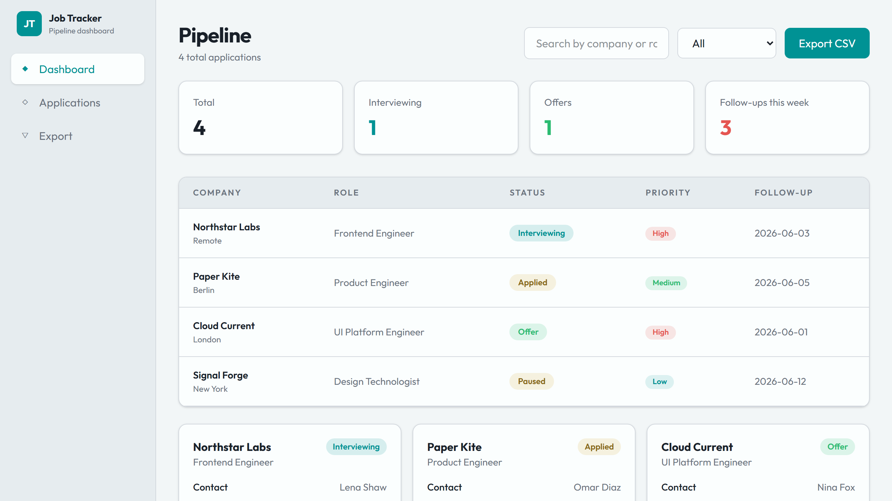

# Job Application Tracker

Job Application Tracker is a local-first Next.js dashboard for tracking companies, roles, statuses, follow-up dates, notes, and contacts. It uses a SQLite-oriented data layer and can export visible records as CSV.

## Screenshot



## Live demo

https://job-application-tracker-lemon-nine.vercel.app

## Why it exists

Job searches get messy fast. Notes live in one place, follow-up dates in another, and export is usually an afterthought. This project packages the essentials into a focused local-first dashboard that feels practical without requiring a hosted backend.

## Demo workflow

1. Review pipeline summary cards at the top of the dashboard.
2. Filter by status and search by company, role, or location.
3. Inspect contact details and notes, then export the filtered view as CSV.

## Features

- Dashboard summary for pipeline counts and upcoming follow-ups
- Filterable application table
- Text search across company, role, and location
- Contact and notes detail cards
- CSV export for the current view
- SQLite-oriented demo database bootstrap with `sql.js`

## Portfolio value

- shows product-focused dashboard design rather than a generic CRUD table
- demonstrates data shaping, filtering, CSV export, and local database bootstrap
- includes believable maintenance structure with issues, PR templates, CI, changelog, and releases

## Tech Stack

- Next.js 16 App Router
- React 19
- TypeScript
- Tailwind CSS 4
- `sql.js`
- Vitest

## Getting Started

```bash
npm install
npm run dev
```

Open `http://localhost:3000`.

## Verification

```bash
npm run test
npm run lint
npm run typecheck
npm run build
```

## Roadmap

See `docs/ROADMAP.md`.

## Contributing

Open an issue before major schema or workflow changes. The current scope is intentionally local-first and setup-light.

## Release

See `docs/RELEASE_CHECKLIST.md`.

## License

MIT
